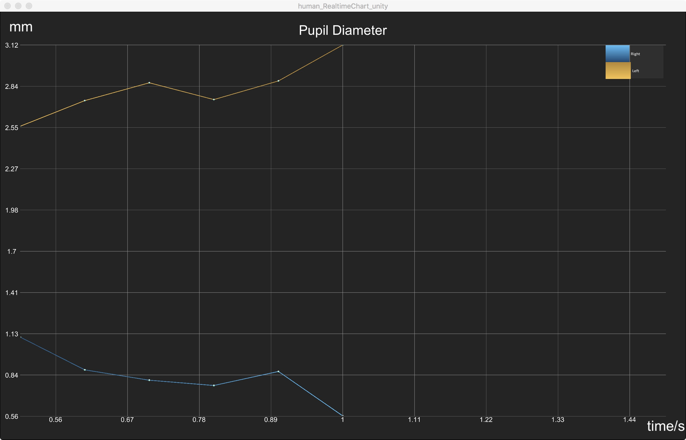

# human_RealtimeChart_Unity

Client Unity Project for Pupil Diamter monitor
Chart sample ([Graph and Chart](https://assetstore.unity.com/packages/tools/gui/graph-and-chart-78488))



## Requirements

- Python
  - 2.7.10
- Unity3D
  - 2018.1.6f1 or greater
- Chart and Graph
  - 1.22 or greater

## Run

```
 open Unity3D Editor, import the project and open Scenes/MainScene
```


